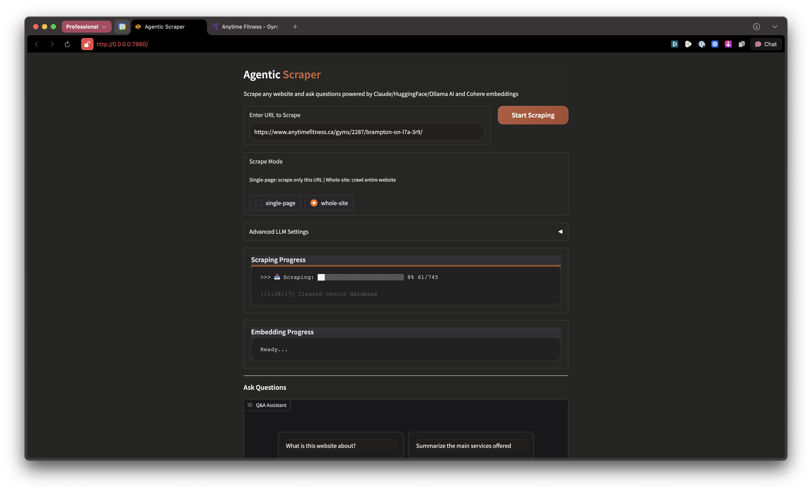
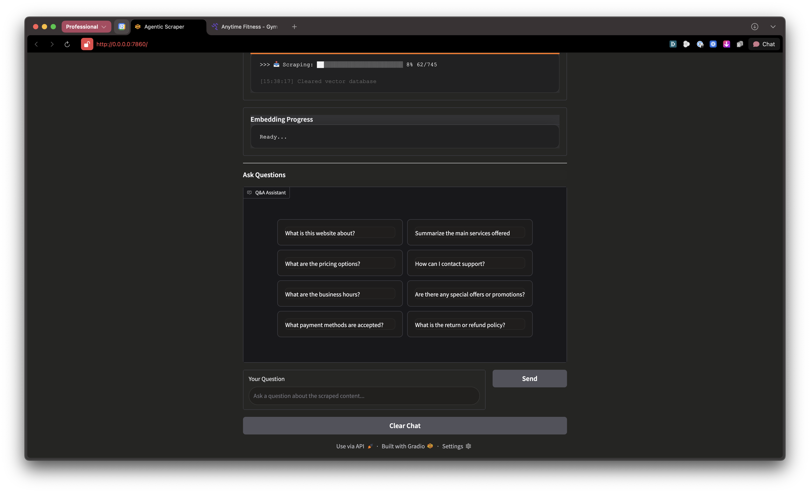

# Agentic Scraper

Scrape any website and chat with its content using AI.





---

## Quickstart

> **Requirements:** Python 3.11+

### 1. Clone & Setup

```bash
git clone https://github.com/yourusername/scraper-agent.git
cd scraper-agent

# Create virtual environment
python3 -m venv venv

# Activate it
source venv/bin/activate        # Mac/Linux
# venv\Scripts\activate         # Windows

# Install dependencies
pip install -r requirements.txt
playwright install chromium
```

### 2. Get API Keys

You'll need API keys from these services (free tiers available):

| Service | Get Key | Required? |
|---------|---------|-----------|
| **Cohere** | [dashboard.cohere.com](https://dashboard.cohere.com/api-keys) | Yes (embeddings) |
| **Anthropic** | [console.anthropic.com](https://console.anthropic.com/) | Pick one |
| **HuggingFace** | [huggingface.co/settings/tokens](https://huggingface.co/settings/tokens) | Pick one |
| **Ollama** | [ollama.com](https://ollama.com/) | Pick one |

### 3. Configure

```bash
cp .env.example .env
```

Open `.env` in any text editor and add your keys:

```bash
# Required - for embeddings
COHERE_API_KEY=paste-your-cohere-key-here

# Pick one LLM provider:
ANTHROPIC_API_KEY=sk-ant-...      # Claude (recommended)
# or
HUGGINGFACE_API_KEY=hf_...        # HuggingFace
# or
OLLAMA_API_KEY=...                # Ollama Cloud
```

### 4. Run

```bash
python frontend/app.py
```

Open http://localhost:7860 in your browser.

---

## Usage

### Web UI

1. **Enter URL** - Paste any website URL
2. **Select Mode**
   - `single-page`: Scrape only the URL you entered
   - `whole-site`: Crawl entire site via sitemap
3. **Click "Start Scraping"** - Watch the progress bar
4. **Wait for embedding** - Automatic after scraping
5. **Ask questions** - Use the chat interface or preset buttons

### FastAPI Mode

Run the backend API server:

```bash
python -m uvicorn backend.src.main:app --host 0.0.0.0 --port 8000
```

**Endpoints:**

| Method | Endpoint | Description |
|--------|----------|-------------|
| `POST` | `/api/scrape` | Start scraping a URL |
| `GET` | `/api/sessions` | List all sessions |
| `GET` | `/api/sessions/{id}` | Get session details |
| `POST` | `/api/embed/` | Generate embeddings |
| `POST` | `/api/query/ask` | Ask a question (RAG) |
| `GET` | `/health` | Health check |

**Example - Scrape a site:**

```bash
curl -X POST http://localhost:8000/api/scrape \
  -H "Content-Type: application/json" \
  -d '{"url": "https://example.com", "mode": "whole-site"}'
```

**Example - Ask a question:**

```bash
curl -X POST http://localhost:8000/api/query/ask \
  -H "Content-Type: application/json" \
  -d '{"question": "What services are offered?"}'
```

API docs available at http://localhost:8000/docs

---

## How It Works

```
┌─────────────┐     ┌─────────────┐     ┌─────────────┐
│  Scraping   │ --> │  Embedding  │ --> │    Chat     │
│  Playwright │     │   Cohere    │     │ Claude/HF/  │
│  + Sitemap  │     │  + ChromaDB │     │   Ollama    │
└─────────────┘     └─────────────┘     └─────────────┘
```

1. **Scrape**: Discover URLs from sitemap, fetch with Playwright, convert to markdown
2. **Embed**: Chunk content, generate Cohere embeddings, store in ChromaDB
3. **Chat**: Vector search + rerank, synthesize answer with LLM

---

## Configuration

All settings in `.env`:

```bash
# Embeddings (required)
COHERE_API_KEY=...

# LLM Providers (pick one)
ANTHROPIC_API_KEY=...           # Claude
HUGGINGFACE_API_KEY=...         # HuggingFace Inference
OLLAMA_API_KEY=...              # Ollama Cloud
OLLAMA_HOST=http://localhost:11434  # Local Ollama

# Optional
STORAGE_BASE_PATH=./data
CHROMA_DB_PATH=./chroma_db
DEBUG=True
```

---

## Project Structure

```
scraper-agent/
├── frontend/
│   └── app.py              # Gradio UI (main entry point)
├── backend/
│   └── src/
│       ├── main.py         # FastAPI server
│       ├── agents/         # Orchestrator
│       ├── services/       # Storage, vector, browser
│       ├── routes/         # API endpoints
│       └── models/         # Pydantic models
├── .env.example            # Environment template
└── requirements.txt        # Dependencies
```

---

## Tech Stack

| Component | Technology |
|-----------|------------|
| **UI** | Gradio |
| **Scraping** | Playwright + BeautifulSoup |
| **Embeddings** | Cohere embed-v4.0 |
| **Vector DB** | ChromaDB (local) |
| **Reranking** | Cohere rerank-v4.0 |
| **LLM** | Claude / HuggingFace / Ollama |

---

## License

Apache 2.0
